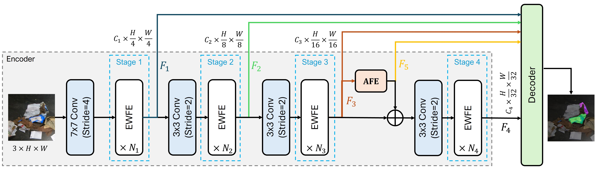

Towards Effective Waste Segmentation for Automated Waste Recycling in Cluttered Background
----
[](https://mustansarfiaz.github.io/EWSegNet/) [](https://arxiv.org/abs/2606.13587)


## Overview
Frequency domain provides much more flexibility for images/features enhancement, however, it remains underutilized in semantic segmentation. Our work demonstrates how frequency domain can be used to effectively segment the waste objects in cluttered scenes. The main contributions of the work is to introduce EWFE layer and AFE module that optimally captures global context by using data-dependent kernels in the frequency domain and emphasize the boundaries of waste objects using difference of Gaussian filter. The network provides favorable segmentation performance and efficiency.




## Setup

The codebase is adapted from [COSNet](https://github.com/techmn/cosnet) repository.
- Install libraries: 

```
pytorch v1.10.1+cu111
mmsegmentation v0.13.0
mmcv 1.4.0
```

Instructions for mmsegmentation are available [here](https://github.com/open-mmlab/mmsegmentation/tree/v0.13.0).

## Datasets

- Download the datasets [[Zero-Waste-f]](https://github.com/dbash/zerowaste) &nbsp; [[Zero-Waste-aug]](https://zenodo.org/records/6412647) &nbsp; [[Spectral-Waste]](https://sites.google.com/unizar.es/spectralwaste)

## Training
Use following commands to train the model:

**Zero-Waste-f and ZeroWaste-aug dataset**

Set the dataset path in `configs/_base_/datasets/zero_waste.py` then use below command for training.
```
python train.py configs/ewsegnet/uper_zerowaste_40k.py
```

**Spectral-Waste dataset (RGB only)**
```
python train.py configs/ewsegnet/uper_specwaste_40k.py
```

**Model Weights**

<table>
  <tr>
    <th>Dataset</th>
    <th>mIoU Score</th>
    <th>Link</th>
  </tr>
  <tr>
    <td>ZeroWaste-aug</td>
    <td>74.10</td>
    <td><a href=''>download</a></td>
  </tr>
  <tr>
    <td>ZeroWaste-f</td>
    <td>57.14</td>
    <td><a href=''>download</a></td>
  </tr>
  <tr>
    <td>ZeroWaste-f</td>
    <td>56.88</td>
    <td><a href=''>download</a></td>
  </tr>
  <tr>
    <td>SpectralWaste</td>
    <td>71.03</td>
    <td><a href=''>download</a></td>
  </tr>
</table>

> Download ImageNet-1k weights from [here]()

**Note:** Background is not included in mIoU of SpectralWaste.

## Evaluation
```
# Zero-Waste-f and ZeroWaste-aug
python test.py configs/ewsegnet/uper_zerowaste_40k.py <path to checkpoint_best.pth> --eval mIoU

# Spectral-Waste
python test.py configs/ewsegnet/uper_specwaste_40k.py <path to checkpoint_best.pth> --eval mIoU
```


## See Also
- [COSNet](https://github.com/techmn/cosnet) &nbsp; COSNet: A Novel Semantic Segmentation Network using Enhanced Boundaries in Cluttered Scenes (WACV 2025)
- [FANet](https://github.com/techmn/fanet) &nbsp; FANet: Feature Amplification Network for Semantic Segmentation in Cluttered Background (ICIP 2024)


## Citation
```
@inproceedings{ewsegnet2026,
  title = {Towards Effective Waste Segmentation for Automated Waste Recycling in Cluttered Background},
  author = {Javaid, Mamoona and Noman, Mubashir and Hannan, Abdul and Nawaz, Shah and Fiaz, Mustansar and Ghuffar, Sajid},
  booktitle = {International Conference on Machine Learning (ICML)},
  year = {2026}
}
```
